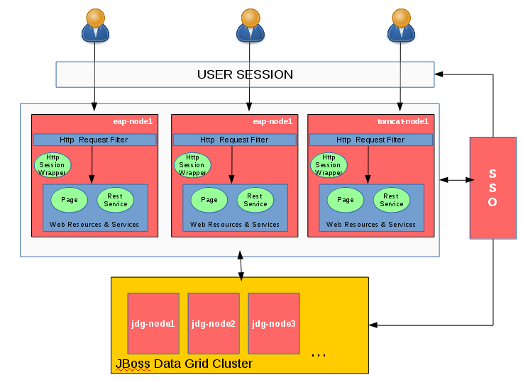
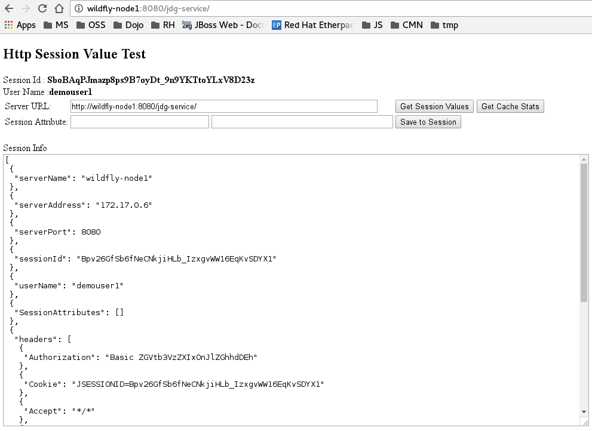

Http Session Externalization & Sharing on JBoss Data Grid
===========
This is an demo project to show a simple technique to externalize HttpSession from application server's local cache to external data store which is JBoss DataGrid/Infinispan in this case. Session externalization is highly desirable technique to increase resilience of applications, so that applications can recover their sessions after unexpected crashes.   

In some cases it's highly desirable to share session in between disparate applications and services. Nowadays more and more applications structured and deployed as multiple small components as in micro services and modular architectures. It's also not that rare to see application components are deployed on to different platforms. One service might be implemented and deployed as Spring Boot application and another service might be deployed to JBoss EAP. Heterogeneous  environments everywhere.

Although JBoss Data Grid/Infinispan has an [out of the box capability](https://access.redhat.com/documentation/en-US/Red_Hat_JBoss_Data_Grid/7.0/html/Administration_and_Configuration_Guide/chap-Externalize_Sessions.html#Externalize_HTTP_Session_from_JBoss_EAP_7.x_to_JBoss_Data_Grid) that you can externalize HttpSession to JBoss DataGrid/Infinispan on JBoss EAP/Wildfly, that out of the box capability allows session sharing in between applications that are only the part of the same enterprise application (ear). According to the [JEE Servlet Specification](https://java.net/downloads/servlet-spec/Final/servlet-3_1-final.pdf) HttpSession objects must be scoped at the application (or servlet context) level.  

In this demo I'm using a simple filtering technique to wrap Http Session object to replace local cache with a JBoss Data Grid technique. In this example the application is deployed on to three distinct application server. The application is not a clustered /distributed application, so it's really not any different than deploying three different applications. The diagram below depicts the overall demo system context. The flow of a request is below:
1. User sends a request (either a page or a service request)
2. HttpRequestFilter intercepts that request and replaces the regular HttpSession object with the Grid one.
3. Page or  service components processes the request regularly and if it's needed uses the HttpSession in a regular way. The grid session object uses the data grid instead of the local cache.


  

I believe that the flow that I've explained above can be applicable to any other platform. All you need is a way to intercept requests, wrap session object and use the suitable data grid library to communicate with it. JBoss DataGrid/Infinispan offers a [rich library set](https://access.redhat.com/documentation/en-US/Red_Hat_JBoss_Data_Grid/7.0/html/Feature_Support_Document/JBoss_Data_Grid_Features_and_Usage_Modes.html) for different platforms.

Although the flow I've explained above is good enough to externalize HttpSession, session sharing in between application servers/platforms requires some extra tricks. Since JEE scopes HttpSession at the application level, session identities (like JSESSIONID) are not shared in between application servers. Therefore, application level Http Session does not offer required context and a higher level context is needed. That context should be bounded to a unique  concept like user id, client id which  can help us to distinguish the source of the requests. If you prefer to use the user identity as I do in this example, there are helpful SSO solutions like [Red Hat SSO / JBoss Keycloak](https://access.redhat.com/products/red-hat-single-sign-on) to implement this concept.

  

As I've mentioned, user id used to create a shared session concept in this example. However, for the sake of the simplicity of the example, there is no SSO solution in place and authentication should be done manually as entering username, password pair.  

# Prerequisites to Run
## Docker
All of the application server in this demo hosted in docker containers, so you need **docker** to run images and also build some images. Docker must be installed and configured. See the following documentation to download and configure docker on your platform

* [Red Hat Enterprise Linux](https://docs.docker.com/installation/rhel/)
* [Mac OS X](https://docs.docker.com/installation/mac/)
* [Microsoft Windows](https://docs.docker.com/installation/windows/)

A comprehensive platform list can be found [here](https://docs.docker.com/installation/)

To get started with Docker, please refer to the official [user guide](https://docs.docker.com/userguide/)

## JDK 1.8 and Maven 3+

 Demo project is written in Java language as mavenized project. You need to have both JDK 1.8+ and Maven

* [JDK 1.8 install guide](http://openjdk.java.net/install/)
* [Maven installation guide](http://maven.apache.org/install.html)

## Linux
  All of my demo scripts prepared to run on Linux, you need to adopt run and destroy scripts for your OS.

## Git
   Git is needed to clone this repo to your local

# How to Run
  The first thing that you need to do is clonning this project to your local
  ```
  git clone -r https://github.com/serhat-dirik/jboss-generic-http-session-externalization-to-jdg
  ```
## Demo with JBoss Community Projects
If you've successfully installed all prerequisites and have an healthy internet connection, all you need to do is executing the start script.

```
./runCommunityDemo.sh
```

On the initial run it will download required docker images from docker hub, so this might be a time consuming operation depending your internet connection speed. As part of the execution maven build processes will be triggered and two deployable application will be prepared under deployments subdirectory."jdg-service.war" application is prepared to deploy wildfly containers and "jdg-service4tomcat.war" is prepared to deploy on to tomcat. Why different applications? This is simply because of tomcat has no rest library and additional libraries need to be deployed with web application.

Start script will add hostnames into your /etc/hosts file, so you can access containers by their host names. Open your favorite browser and goto [http://wildfly-node1:8080/jdg-service](http://wildfly-node1:8080/jdg-service) url. It will ask your credentials to log into the application. ```user:demouser1 password:redhat1!``` or ```user:demouser2 password:redhat1!``` credentials can be used.



Place a session attribute as putting a key into first box and a value into the second box and click on the "save to session" button. Now switch to another server, either  [http://wildfly-node2:8080/jdg-service](http://wildfly-node2:8080/jdg-service) or [http://tomcat-node1:8080/jdg-service](http://tomcat-node1:8080/jdg-service)  one. Use the same credentials to login and click on the "Get Session Value" button and check what you've in "SessionAttributes" in your result set.

### What else you can test?
Assuming that you're on the [http://wildfly-node1:8080/jdg-service](http://wildfly-node1:8080/jdg-service) app server, you can check what happens on an application server restart. Stop wildfly-node1:

```
docker stop wildfly-node1
docker rm wildfly-node1
```
Start it back
```
docker run -d --name wildfly-node1 --hostname wildfly-node1.docker --link jdg-node1:jdg-node1 --link jdg-node2:jdg-node2 --link jdg-node3:jdg-node3 -v $(pwd)/wildflyConfig:/wildflyConfig -v $(pwd)/deployments:/deployments --dns $(docker inspect -f '{{.NetworkSettings.IPAddress}}' docker-dns) --dns-search docker jboss/wildfly:10.1.0.Final /bin/bash -c "/wildflyConfig/executeDemo.sh"
```
Now just go back to your browser and refresh it
### Destroying The Demo
Simply execute the ```destroyCommunityDemo.sh``` script

## Demo with JBoss Products
If you'd like to run this demo with RedHat products instead of community projects, there are additional steps before you execute the demo.

### Build jboss-demo/jdk image
You need to build [jboss-demo/jdk](./docker-demo-images/image-jdk/README.md) image first. This is the base image that other images  extending.
```
cd docker-demo-images/image-jdk
./build.sh
```
After a successful build image should be placed in your local repo

```
docker images | grep jboss-demo/jdk
```
### Build jboss-demo/eap7 image
You need to build [jboss-demo/eap7](./docker-demo-images/image-eap7/README.md) image to run JBoss Enterprise Application Platform v7.  

```
cd docker-demo-images/image-eap7
./build.sh
```
After a successful build image should be placed in your local repo

```
docker images | grep jboss-demo/eap
```
### Build jboss-demo/jdg7 image
You need to build [jboss-demo/jdg7](./docker-demo-images/image-jdg7/README.md) image to run JBoss Data Grid v7.  

```
cd docker-demo-images/image-jdg7
./build.sh
```
After a successful build image should be placed in your local repo

```
docker images | grep jboss-demo/jdg
```
### Execution
If you've successfully installed all prerequisites, complete the preliminary steps and have an healthy internet connection, all you need to do is executing the start script.

```
./runProductDemo.sh
```

On the initial run it will download required docker images from docker hub, so this might be a time consuming operation depending your internet connection speed. As part of the execution maven build processes will be triggered and two deployable application will be prepared under deployments subdirectory."jdg-service.war" application is prepared to deploy eap7 containers and "jdg-service4tomcat.war" is prepared to deploy on to tomcat. Why different applications? This is simply because of tomcat has no rest library and additional libraries need to be deployed with web application.

Start script will add hostnames into your /etc/hosts file, so you can access containers by their host names. Open your favorite browser and goto [http://eap-node1:8080/jdg-service](http://eap-node1:8080/jdg-service) url. It will ask your credentials to log into the application. ```user:demouser1 password:redhat1!``` or ```user:demouser2 password:redhat1!``` credentials can be used.


Place a session attribute as putting a key into first box and a value into the second box and click on the "save to session" button. Now switch to another server, either  [http://eap-node2:8080/jdg-service](http://eap-node2:8080/jdg-service) or [http://tomcat-node1:8080/jdg-service](http://tomcat-node1:8080/jdg-service)  one. Use the same credentials to login and click on the "Get Session Value" button and check what you've in "SessionAttributes" in your result set.

### What else you can test?
Assuming that you're on the [http://eap-node1:8080/jdg-service](http://eap-node1:8080/jdg-service) app server, you can check what happens on an application server restart. Stop eap-node1:

```
docker stop eap-node1
docker rm eap-node1
```
Start it back
```
docker run -d --name eap-node1 --hostname eap-node1.docker --link jdg-node1:jdg-node1 --link jdg-node2:jdg-node2 --link jdg-node3:jdg-node3 -v $(pwd)/eapConfig:/eapConfig -v $(pwd)/deployments:/deployments --dns $(docker inspect -f '{{.NetworkSettings.IPAddress}}' docker-dns) --dns-search docker jboss-demo/eap:7 /bin/bash -c "/eapConfig/executeDemo.sh"
```
Now just go back to your browser and refresh it
### Destroying The Demo
Simply execute the ```destroyProductDemo.sh``` script

# A Side Note
 On a real  production environment I strongly suggest that you handle sessions, session expiration, security and other concerns. Placing an SSO solution like Red Hat SSO/Keycloak into your solution design can complete the overall solution and improve the overall user experience. 
